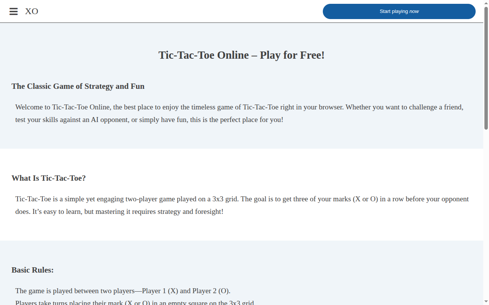

# Tic Tac Toe

A classic Tic Tac Toe game built with vanilla HTML, CSS, and JavaScript. Play against another player locally with a simple and responsive UI.



## 🔗 Live Demo

[View Tic Tac Toe Live](https://tictactoe-ip3ula.vercel.app)

## 🛠️ Features

- 2-player local game mode
- Win and draw detection
- Game restart option
- Clean and responsive UI

## 📂 Technologies Used

- HTML
- CSS
- JavaScript (Vanilla)

## 📸 Screenshot


## 🚀 Getting Started

1. Clone the repository:
   ```bash
   git clone https://github.com/ip3ula/tictactoe.git
